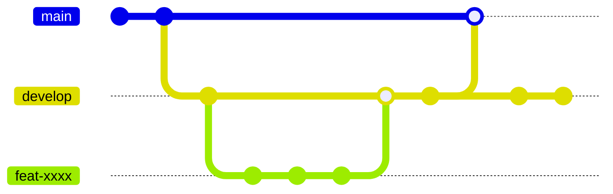

# Github Flow



## Branch 별 설명

### main

Live Server에 올라가는 코드입니다. `develop branch`에서만 merge를 할 수 있습니다.

`main branch`에는 직접 Commit이 금지됩니다.

### develop

**Default Branch** 입니다.

`develop branch`에는 언제나 `main branch`에 merge 할 수 있는 품질과 안정성이 보장된 코드가 유지 되어야 합니다.

<aside>
📌 `develop branch` 에 코드를 merge 할 때에는 무조건 `Pull Request`를 거쳐 1명 이상의 Reviewer에게 코드 리뷰 승인을 받아야 합니다!
`Hotfix` 상황을 제외하고는 직접 Commit이 금지됩니다.

</aside>

### feature

하나의 Backlog 단위로 생성되는 Branch 입니다.

`develop branch` 로부터 생성된 branch 일 때는 `develop branch` 로 Pull Request를 거쳐 Merge 해야 합니다.

`feature branch`는 branch 이름 세팅 시 `Backlog` 의 간단한 요약을 접미사로 추가해야 합니다.

> ex) `feat-14-spring-security-config` - Spring Security 기술을 도입하고, 설정한다.
> 

## Commit Convention

```
ex) feat:로그인 페이지를 추가한다.
```

### Type

Commit의 성격과 목적을 드러내는 사전에 정의된 단어 중 하나를 작성합니다.

| 태그      | 설명                                                       |
|-----------|----------------------------------------------------------|
| **build** | 빌드 시스템에 변화가 있거나 외부 라이브러리 의존성을 변경했을 때 |
| **ci**    | 지속적 통합과 관련된 작업일 때                           |
| **chore** | 코드 수정 없이 설정 값 등을 변경하는 사소한 작업일 때     |
| **docs**  | 문서화 관련 작업일 때                                     |
| **feat**  | 새로운 기능을 추가했을 때                                 |
| **fix**   | 버그 혹은 이슈를 수정, 패치할 때                         |
| **perf**  | 퍼포먼스 측면에서 코드에 변화를 주었을 때                |
| **refactor** | 코드적인 리팩토링을 진행할 때 (비즈니스 요구사항, 기능 플로우 수정 X) <br> 디렉토리 이동, 수정, 이름 변경 등도 해당 |
| **revert** | git revert 실행 시                                       |
| **style** | 오타 수정, 공백 제거 등 정말 사소한 작업일 때             |
| **test**  | 테스트 코드를 추가, 수정, 삭제할 때                      |

### Description

해당 Commit에서 어떤 변경사항이 발생했는지 다른 사람이 직관적으로 이해할 수 있도록 요약해 작성합니다.

**커밋 메시지는 한글로 ~~한다 의 스타일로 작성합니다.**

> ex) Spring Security 의존성을 Gradle에 추가한다, Switch Component를 퍼블리싱한다 등


## References
- [Google Style Guide](https://github.com/google/styleguide)
- [뱅크샐러드 styleguide](https://github.com/banksalad/styleguide)
